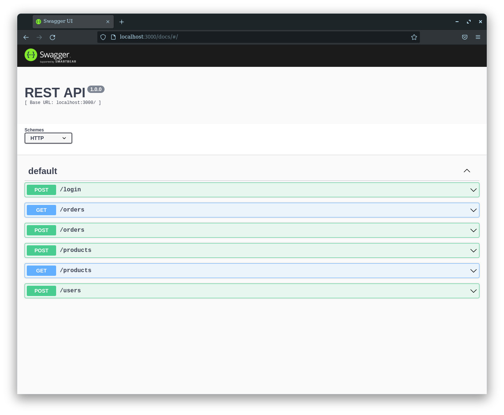

# Medieval Store

Este projeto é uma loja de itens medievais, no formato de uma API, utilizando Typescript.

Desenvolvido usando as camadas de aplicação (Models, Service e Controllers) o código , por meio dessa aplicação, realiza as operações básicas que se pode fazer em um determinado banco de dados: Criação, Leitura, Atualização e Exclusão (ou CRUD, para as pessoas mais íntimas  Create, Read, Update e Delete).

Há endpoints que irão ler e escrever em um banco de dados, utilizando o MySQL.

#
## Tecnologias utilizadas

- Nodejs
- Express
- Typescript
- Mysql
- JWT - Token
- Swagger

#

> Esse projeto foi realizado como avaliação no meu curso de backend na Trybe, assim recebi alguns arquivos prontos e que não desenvolvi, como o `Trybesmith.sql`, `Docker-composer.yml`, `index.ts` e o esqueleto do `app.ts`.

#

## Utilizando o projeto

### Requisitos para rodar a API

Para que a API funcione como o esperado precisamos ter o Banco de dados MySQL instalado ou rodando em um Container Docker.
A API usa variáveis de ambiente para algumas configurações. Na raiz do repositório clonado na sua máquina crie um arquivo chamdo `.env` com o conteúdo a seguir.
> Troque o conteúdo das variáveis MYSQL para as configuradas no Banco de Dados da sua máquina.

~~~
- DATABASE VARS -

MYSQL_HOST=localhost
MYSQL_USER=root
MYSQL_PASSWORD=root

- SECRECT VARS -
JWT_SECRET=ChaveSecretaParaOJWT
~~~

#

1. Primeiro precisamos clonar o repositório.
~~~bash
git clone git@github.com:Alexsandro-01/Medieval-store.git
~~~

2. Depois do repositório clonado e já no diretório do repositório, vamos instalar as dependências.

~~~bash
npm install
~~~

3. Agora para o `Mysql`  criar o Banco de dados e as tabelas usadas pela API, é necessário executar as querys presentes no arquivo `Trybesmith.sql` que está na pasta raíz.

4. Finalmente para subir os serviços da API.
~~~bash
npm start
~~~

5. A API foi documentada usando o `Swagger` (estou aprendendo a usar), para ter acesso a quais as rotas disponivéis na API, acesse a rota `http://localhost:3000/docs/` no seu navegador e verá uma página semelhante a essa:

